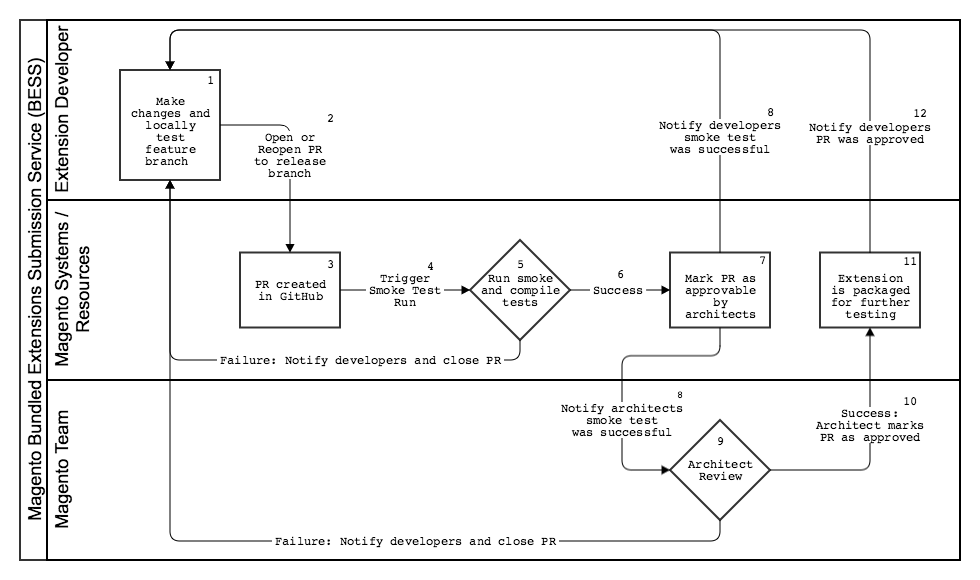
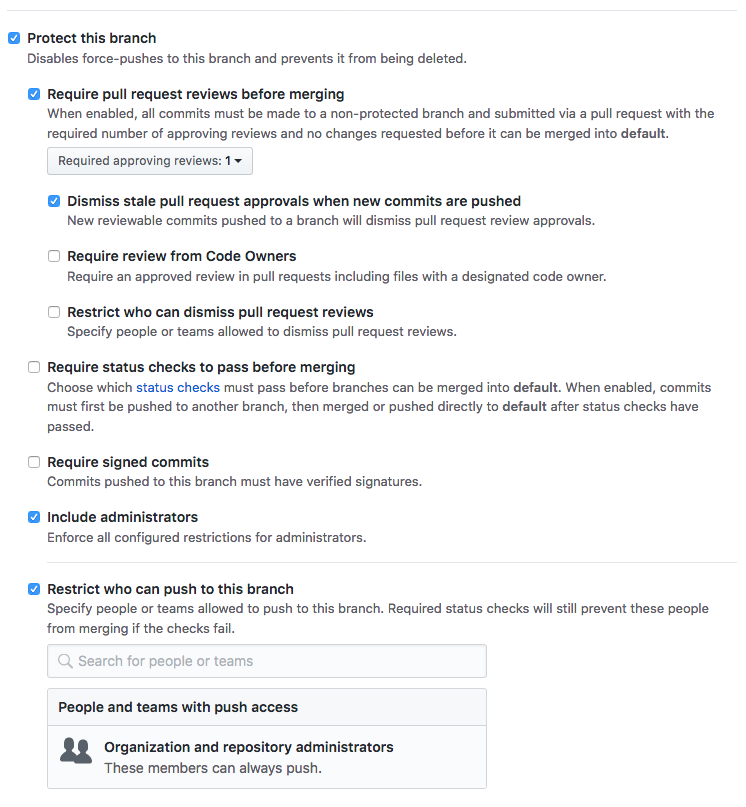
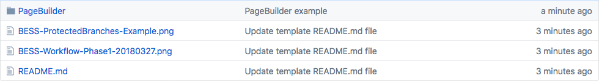

# Bundled Extensions Example Repository _(ext-submit-example)_

> Example Bundled Extension submission repository.

This repository forms part of Magento's Bundled Extensions Submission Service (BESS for short). 

With BESS, our intention is to provide Magento Bundled Extension partners with an endpoint that streamlines the experience of submitting, reviewing, testing and approving our partner's extensions.  

## Table of Contents
- [Install](#install)
- [Usage](#usage)
- [Contribute](#contribute)
- [License](#license)

## Install
Your repository has already been set up to integrate with BESS and is ready to receive submissions. 

### For Git Users
If you manage your extension's source code using Git, you can begin submitting code for review right away by adding this repository as a new "remote" for your project. Once this is complete, you can push your branches to this new origin.

#### Adding Remote Repositories
To add a new remote Git repository as a short name you can reference easily, run `git remote add <shortname> <url>`:

```
$ git remote add bess https://github.com/magento/ext-submit-example.git
```

Now you can use the string `"bess"` on the command line in lieu of the whole URL. For example, if you want to push your `master` branch to this repository, you can run:

```
$ git push bess master
```

For more information, please see Git's official documentation, "Git Basics - Working with Remotes", [here](https://git-scm.com/book/en/v2/Git-Basics-Working-with-Remotes).

### For Non-Git Users
BESS only accepts submissions from this GitHub repository and does not offer support for other version control systems. If your extension exists outside of Git, we recommend cloning this repository and copying your code into the cloned directory and push your submissions from there. 

You may choose to migrate and manage all of your extension's code from this new repository or only use it for submissions to Magento.

## Usage
### BESS Workflow


1. Partners develop and test locally. When ready, developers push their feature branch to their new remote (this repository).
2. When changes for a specific release want to be submitted for testing and review, developers must open a Pull Request (PR) in GitHub, from their feature branch against the intended release branch.
3. When a PR is created, it may not be merged until after smoke testing is successful and a Magento Architect has reviewed and approved it.
4. Opening a PR against any of the repository's release branches triggers an automated smoke-testing process.
5. The smoke-testing process verifies that an extension contains a valid `composer.json` file and can be installed without errors on the lastest development version of Magento. The validity of a `composer.json` file is determined by executing the `composer validate` command from a CLI based on the [Composer JSON schema](https://getcomposer.org/doc/04-schema.md).
6. If smoke-test results are all positive, the system marks the originating PR as approvable by Magento Architects. If not, partner developers are notified via e-mail with an attached copy of the build logs and the PR is closed.
7. Once a PR is marked for approval, both developers and architects are notified via e-mail, along with a copy of the build logs for that PR run.
8. See step 7.
9. Architects review the PR submission and may approve or request changes.
10. If a PR submission is approved, an architect will merge the PR into the release branch. If not, an architect will mostly likely request changes, in which case, partner developers are notified via e-mail and the PR is closed.
11. Once a merge happens on a release branch, the code is pulled from that branch, packaged and pushed to an interal artifact repository to be handed-off for further testing.
12. Developers are notified via e-mail that the PR was approved and merged.

### Working with Branches
BESS repositories allow Partners to apply any branching strategy they wish to implement. However, to leverage the benefits of BESS, the following requirements must be met:

- The submission process (smoke testing, PR approval, etc.) is triggered only by the creation (opening or re-opening) of a Pull Request from a feature branch against a release branch.
- Release branches must follow this naming convention: `<sem-ver>-release`, where `<sem-ver>` corresponds to the Magento version the extension is compatible and being released with, e.g.: `2.3.0-release`. An extension may have one or more release branches.
- New Bundled Extension version releases will only be packaged and published from the latest release branch state for each available version.
- No pre-conditions are imposed on Feature branches.

#### Branch protection
Release branches that follow the naming convention above are automatically marked as `protected` in GitHub upon creation. This ensures new version releases follow the BESS process and have been appropriately tested and approved by Magento. This also protects these branches from being accidentally deleted or commited against.



### Directory Structure
All Magento extensions must implement the following directory structure:

###### Modules
```
<repo_root>/
    composer.json (metapackage, optional)
    <Module1>
        composer.json
    <Module2>
        composer.json
    <Module1SampleData>
    <Module2SampleData>
```

###### Metapackage File
In the case your extension consists of multiple modules, a `composer.json` file must be included with your submission at the root of your extension's directory. Declare the `type` field as `metapackage` and list each module as a dependency in the order they must be installed.

```
{
  "name": "magento-bundled-extension",
  "description": "Official Magento 2 Extension",
  "type": "metapackage",
  "version": "1.0.0",
  "license": [
    "GPLv3"
  ],
  "require": {
    "module1": "1.0.0",
    "module2": "1.0.0",
    "module3": "1.0.0"
  }
}
```

> **Warning**: _Do not_ include paths in the names of your packages or it's dependencies, e.g.: "magento/PageBuilder". 

#### Example Directory
###### Repository root

###### Extension module


> **Note**: mixing modules, themes and language packs in the same repository is not allowed.

For more information, please see the Magento DevDocs reference, [here](http://devdocs.magento.com/guides/v2.2/extension-dev-guide/build/module-file-structure.html).

## Support
### Architects
For support or questions regarding your the development of your extension, like best practices or approval guidelines, you may contact your assigned architects directly at {{ext-repo-name}}@magento.com.

### Platform
If you experience any issues with BESS itself, please reach out to Magento's DevOps Team at `dl-magento-devops@magento.com` with a description of your issue and accompanying build logs, if applicable.
